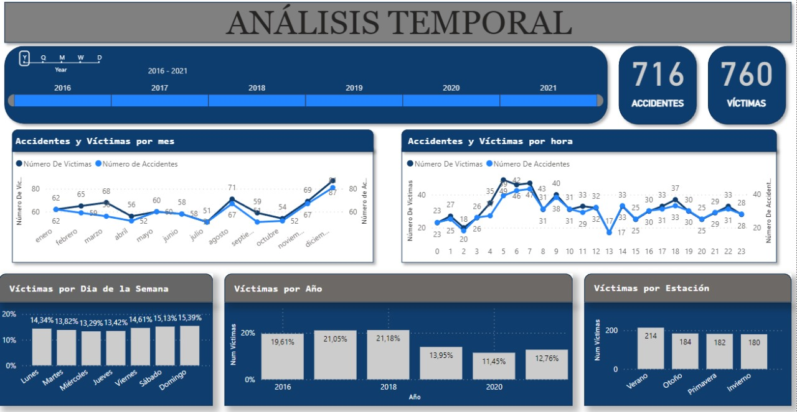
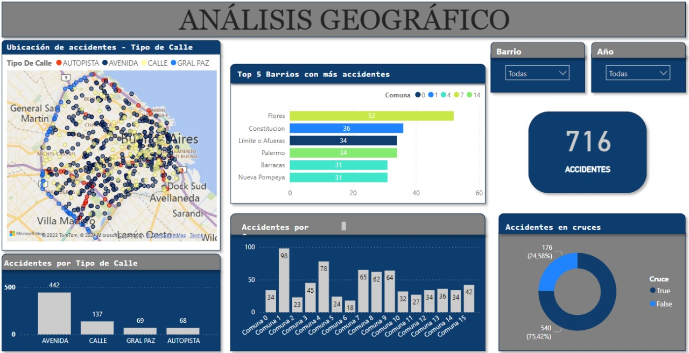
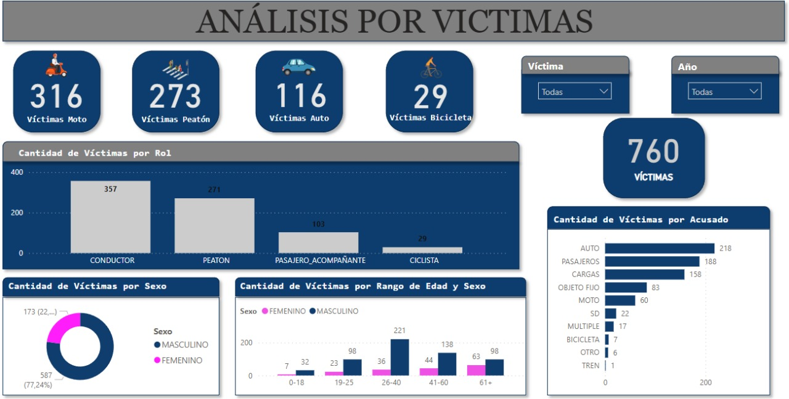
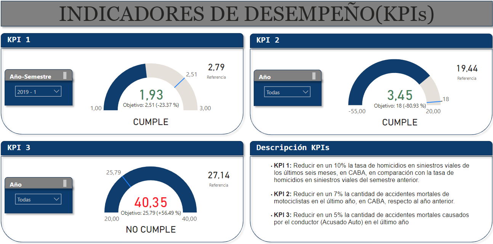

# EN: Road accidents in the City of Buenos Aires (CABA)

## Project Description

In this project, The Mobility and Road Safety Observatory (OMSV), a study center that is under the orbit of the Ministry of Transportation of the Government of the Autonomous City of Buenos Aires, asks us to prepare a data analysis project, in order to to generate information that allows local authorities to take measures to reduce the number of fatalities from road accidents. To do this, they provide us with a dataset on homicides in road accidents that occurred in the City of Buenos Aires during the period 2016-2021.

Steam is a digital distribution platform for video games, it has over 325 million users and offers more than 25,000 games in its catalog.

## Project Structure 

| Folder/File              | Description                                                                                  |
| ------------------------ | -------------------------------------------------------------------------------------------- |
| **/data**                | Folder that stores datasets and files used by the Analysis and DAshboard.                              |
| **/Notebooks**           | Folder containing Jupyter notebooks used for ETL and EDA process |
| **gitignore**            | File specifying folders and files to be ignored by version control (git).                      |
| **LICENSE**              | MIT LICENSE - File specifying the terms under which the source code is shared.                 |
| **Siniestros_viales.sql**| Dimensional tables to get a Database relational model in a SQL system.                            |
| **Siniestros_viales.pbix** | Dashboard with visual analysis of the dataset. |
| **README.md**            | Main project documentation in English.                                                         |
| **README_ESP.md**        | Main project documentation in Spanish.                                                         |

## Transformations and Exploratory Data Analysis (EDA)

- Extraction, Transformation, and Loading (ETL) were performed using the Pandas library.
- Strategies were applied to handle nested data, and irrelevant or highly null columns were removed.
- The Facts and Victims tables were joined by means of a 'merge' in order to obtain a single table with all the relevant information
- Information was added from an API provided by the government of the City of Buenos Aires, with information on the coordinates of each neighborhood leading to the formation of a new column "Barrio"
- In order to respect the information given by the geographical coordinates in the API provided by the government of the City of Buenos Aires , we modified the 'Comuna' column leaving the values ​​at 'Comuna 0' where the coordinates correspond to empty neighborhood (column 'Barrio').
- During the data exploration we found neighborhoods that did not correspond to their respective commune. To preserve the fidelity of the geographical location, we correct the 'Community' column by assigning the commune to which each neighborhood belongs, according to the records of the Government of Buenos Aires.
- Using web-scraping, we download the census data of the city of Buenos Aires, in order to know the population data ud then we used the average annual population growth to estimate the population year by year.
- EDA was conducted on analize datasets using Pandas, Matplotlib, and Seaborn.
- Relevant variables were found and selected to carry out the analyzes in the dashboard presentation, with the aim of leading the case to correct decision-making.
- The data analysis was divided into three sets (Analysis by time variables, Analysis by geographical variables and analysis by victims) for greater order and understanding of the information contained in the dataset with a view to the objective of evaluating ideal performance indicators to make correct decisions.

## Dimensional Tables and Relational Model

- With the variables selected during the analysis, a relational model was created with auxiliary dimensional tables and a main table, in order to organize the information and easily access it.
- The relational model was created by creating a database from a MySQL script.

## Dashboard

- A dashboard is created in PowerBI highlighting the analysis sets established in the EDA.

### Analysis by time variables

### Analysis by geographic variables

### Analysis by victims

- The approach to 3 Key Performance Indicators (KPIs) is presented in the dashboard based on the analysis and the conclusions of each analysis.

- In order to make a presentation to the Mobility and Road Safety Observatory (OMSV) of the city of Buenos Aires, a series of objectives and the respective conclusions are proposed within the Dashboard, according to the analysis and the results found in the evaluation of the KPIs. raised

## Contact 

To learn more about the creator of this project, visit his [LinkedIn profile](https://www.linkedin.com/in/leonardo-cort%C3%A9s-zambrano-13522295/) 

