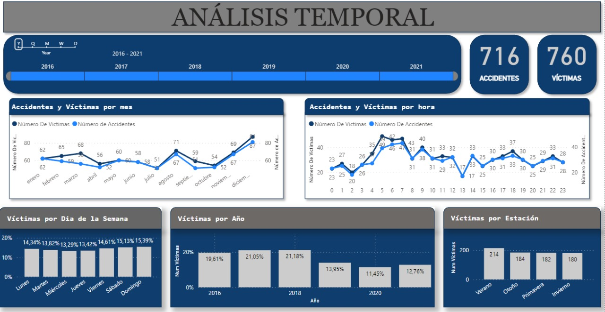

# ESP: Siniestros Viales en la Ciudad de Buenos Aires (CABA)

## Descripción del Proyecto

En este proyecto, el Observatorio de Movilidad y Seguridad Vial (OMSV), un centro de estudio que está bajo la órbita del Ministerio de Transporte del Gobierno de la Ciudad Autónoma de Buenos Aires, nos pide que preparemos un proyecto de análisis de datos, con el fin de generar información que permita a las autoridades locales tomar medidas para reducir el número de fatalidades por accidentes de tránsito. Para ello, nos proporcionan un conjunto de datos sobre homicidios en accidentes de tránsito ocurridos en la Ciudad de Buenos Aires durante el período 2016-2021.

## Estructura del Proyecto

| Carpeta/Archivo          | Descripción                                                                                 |
| ------------------------ | -------------------------------------------------------------------------------------------- |
| **/data**                | Carpeta que almacena conjuntos de datos y archivos utilizados por el Análisis y el Dashboard. |
| **/Notebooks**           | Carpeta que contiene cuadernos Jupyter utilizados para el proceso de ETL y EDA.               |
| **/Images**              | Carpeta que contiene imagenes relevantes e ilustrativas para el análisis del proyecto.         |
| **/Report**              | Carpeta que contiene archivos LaTex y PDF (en inglés y español) con un análisis final y un informe de conclusiones del proyecto.         |
| **gitignore**            | Archivo que especifica carpetas y archivos que deben ser ignorados por el control de versiones (git).   |
| **LICENSE**              | LICENCIA MIT - Archivo que especifica los términos bajo los cuales se comparte el código fuente.|
| **Siniestros_viales.sql**| Tablas dimensionales para obtener un modelo relacional de base de datos en un sistema SQL.      |
| **Siniestros_viales.pbix**| Panel con análisis visual del conjunto de datos.                                              |
| **README.md**            | Documentación principal del proyecto en inglés.                                               |
| **README_ESP.md**        | Documentación principal del proyecto en español.                                              |

## Transformaciones y Análisis Exploratorio de Datos (EDA)

- La Extracción, Transformación y Carga (ETL) se realizaron utilizando la biblioteca Pandas.
- Se aplicaron estrategias para manejar datos anidados y se eliminaron columnas irrelevantes o con muchos valores nulos.
- Las tablas de Hechos y Víctimas se unieron mediante un 'merge' para obtener una única tabla con toda la información relevante.
- Se agregó información de una API proporcionada por el gobierno de la Ciudad de Buenos Aires, con información sobre las coordenadas de cada barrio, lo que llevó a la formación de una nueva columna "Barrio".
- Para respetar la información dada por las coordenadas geográficas en la API proporcionada por el gobierno de la Ciudad de Buenos Aires, se modificó la columna 'Comuna' dejando los valores en 'Comuna 0' donde las coordenadas corresponden a un barrio vacío (columna 'Barrio').
- Durante la exploración de datos, encontramos barrios que no correspondían a sus respectivas comunas. Para preservar la fidelidad de la ubicación geográfica, corregimos la columna 'Comuna' asignando la comuna a la que pertenece cada barrio, según los registros del Gobierno de Buenos Aires.
- Utilizando web scraping, descargamos los datos del censo de la ciudad de Buenos Aires, con el objetivo de conocer los datos de población y luego utilizamos el crecimiento poblacional anual promedio para estimar la población año tras año.
- Se realizó un EDA para analizar los conjuntos de datos utilizando Pandas, Matplotlib y Seaborn.
- Se encontraron y seleccionaron variables relevantes para realizar los análisis en la presentación del panel, con el objetivo de orientar el caso hacia la toma de decisiones correctas.31
- El análisis de datos se dividió en tres conjuntos (Análisis por variables temporales, Análisis por variables geográficas y Análisis por víctimas) para mayor orden y comprensión de la información contenida en el conjunto de datos con miras al objetivo de evaluar indicadores de rendimiento ideales para tomar decisiones correctas.

## Tablas Dimensionales y Modelo Relacional

- Con las variables seleccionadas durante el análisis, se creó un modelo relacional con tablas dimensionales auxiliares y una tabla principal, con el fin de organizar la información y acceder fácilmente a ella.
- El modelo relacional se creó mediante la creación de una base de datos a partir de un script MySQL.

## Panel

- Se creó un panel en PowerBI destacando los conjuntos de análisis establecidos en el EDA.

### Análisis por variables temporales

### Análisis por variables geográficas

### Análisis por víctimas

- Se presenta un enfoque en 3 Indicadores Clave de Rendimiento (KPIs) en el panel basado en el análisis y las conclusiones de cada análisis.

- Con el fin de hacer una presentación al Observatorio de Movilidad y Seguridad Vial (OMSV) de la ciudad de Buenos Aires, se proponen una serie de objetivos y las respectivas conclusiones dentro del Panel, según el análisis y los resultados encontrados en la evaluación de los KPI planteados.

## Informe Final

Finalmente, se realiza un reporte en LaTeX y se presenta en formato PDF con un resumen de análisis realizado con las respectivas conclusiones encontradas durante el trabajo del presente proyecto.

## Contacto

Para obtener más información sobre el creador de este proyecto, visite su [perfil de LinkedIn](https://www.linkedin.com/in/leonardo-cort%C3%A9s-zambrano-13522295/) 

